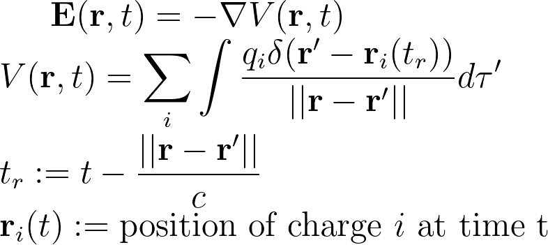
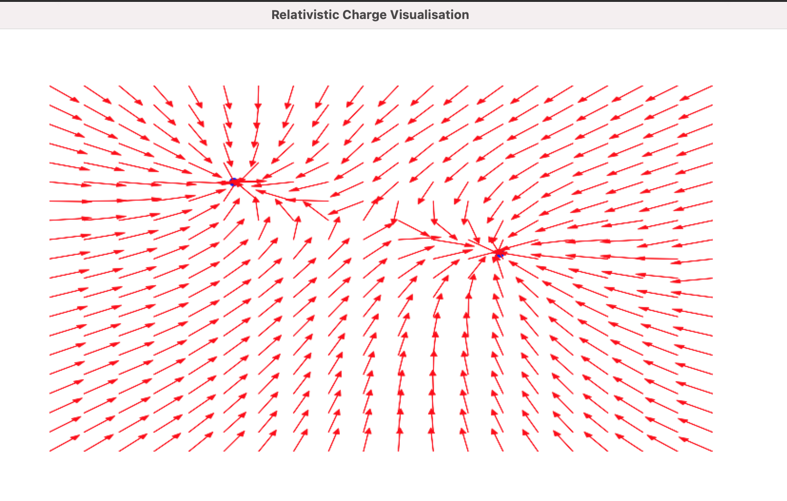

# Relativistic Charge Visualisation

This is a quick project that visualises the relativistic electric field generated by moving charges. More precisely, this is computing:


<p align="center">

</p>


Note the equation above is ignoring magnetic field effects.

How it works:

1. Simply run the following in a desired storage location using `Python 3.8`:

```
git clone https://github.com/sepehrsaryazdi/RelativisticCharge.git
cd RelativisticCharge
pip3 install matplotlib numpy scipy
python3 main.py
```
2. The program will randomly generate two charges of any polarity `+1` or `-1` and draws their electric field.


3. The user can drag charges around and the field will update automatically.



4. Restarting the program will randomly choose the charges, such as opposite charges:


5. The program is relatively slow because of Matplotlib's plotting library; speed-ups can be made using better plotting techniques including caching.
